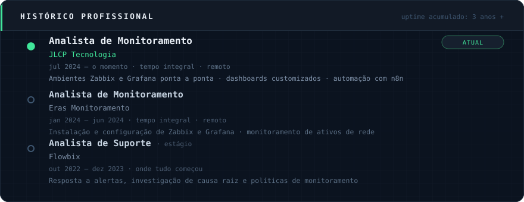

<br>

## Projetos



<sub>
🔗
<a href="https://github.com/MathewsDomingos/zabbix-whatsapp-webhook">zabbix-whatsapp-webhook</a> ·
<a href="https://github.com/MathewsDomingos?tab=repositories">todos os repositórios</a>
</sub>

---

## whoami

```console
$ mateus --describe

NOME       Mateus Domingos
FUNÇÃO     Analista de Monitoramento & Desenvolvedor de Observabilidade
FOCO       transformar métrica crua em decisão de negócio
SETORES    varejo · infraestrutura · rodovias · energia · óleo e gás
IDIOMA     pt-BR (nativo) · en (técnico)
PET        1 gato, uptime 100%

$ mateus --what-i-actually-do

  ├── desenho templates Zabbix (SNMP, SSH, LLD, preprocessing JS, dependent items)
  ├── construo dashboards Grafana que a diretoria entende sem legenda
  ├── escrevo módulos PHP dentro do frontend do Zabbix
  ├── automatizo o chato com n8n, Python e API
  └── conecto alerta → chamado → WhatsApp → relatório, sem ninguém no meio
```

> Não gosto de monitoramento que só pisca vermelho. Gosto do que responde
> *"quanto isso custou?"* e *"o que eu faço agora?"*.

---

## Status ao vivo

<sub>Painel gerado por um GitHub Action a cada 6 horas. Nada aqui é estático.</sub>



---

## Stack

<p align="center">
  
  
  
</p>

<p align="center">
  
</p>

---

## Histórico profissional



---

## Certificações

- **Zabbix Certified User** (ZCU)
- **n8n Automations Advanced** — Rocketseat
- **Boas práticas de Cibersegurança** — IBSEC

---

## Contato

<p align="center">
  <a href="https://www.linkedin.com/in/mathews-domingos"></a>
  <a href="mailto:mateusdomingos.etec@gmail.com"></a>
</p>
